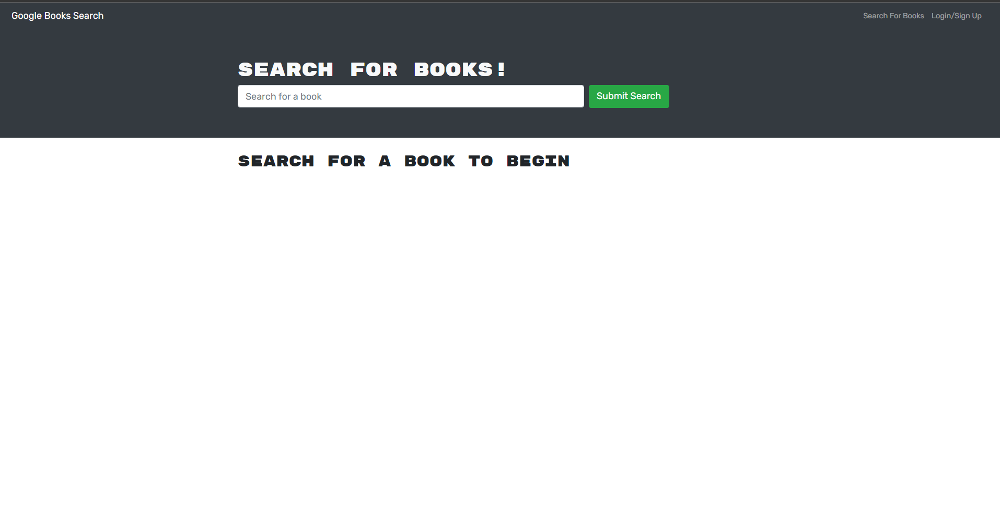
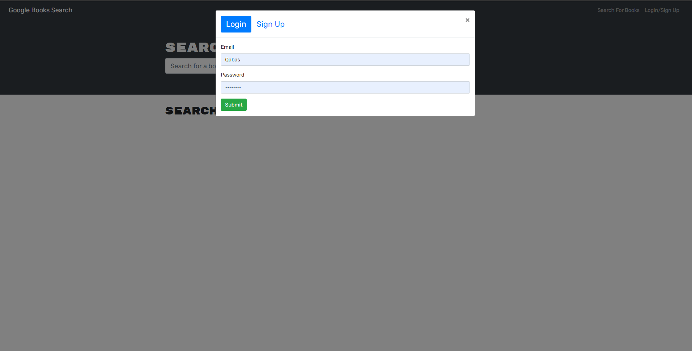
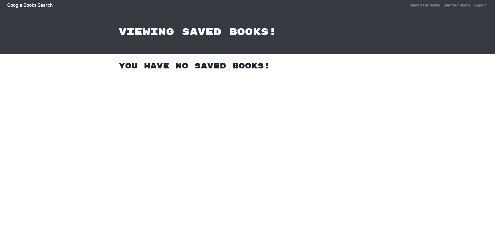

# Book Search Engine
To checkout  the live site on [heroku]( https://afternoon-island-53749.herokuapp.com/ ).

[](https://opensource.org/licenses/MIT)
  
## Table of Contents
- [Description](#description)
- [Installation](#installation)
- [Technologies](#technologies)
- [Usage](#usage)
- [Contribution](#contribution)
- [Questions](#questions)

## Description:
This is a fully functional google search engine book it was created with Restful API and i refactored it to the GraphQL built with Apollo server with the use of the MERN stack with react front end MongoDB database, Node.js, Express and API 


## Technologies
```
-  HTML.
-  CSS.
-  JAVASCRIPT.
-  BOOTSTRAP.
-  REACT.JS.
-  GRAPHQL.
-  APOLLO SERVER.
-  MONGODB DATABASE.
-  NODE.JS.
```


## Features
You look, save, use and delete books.

### Installation
```
npm run develop
```
### Usage
To look for a needed book, save it in your memory and use it later if needed or you delete the list that you have created after you sign in to get your info after its been saved in the local storage

### Contribution
```
  Contributions, issues, and feature requests are welcome!
   Give a ⭐️ if you like this project!
```

### A Screenshot of my deployed Book Search Engine

 
 
 
 
 

### Questions? 
For any questions, please contact me with the information below:

qabasalani1@gmail.com

[LinkedIn Profile](https://www.linkedin.com/in/qabas-al-ani-7b858863/)

[Github Profile](https://github.com/Qabas-al-ani)

